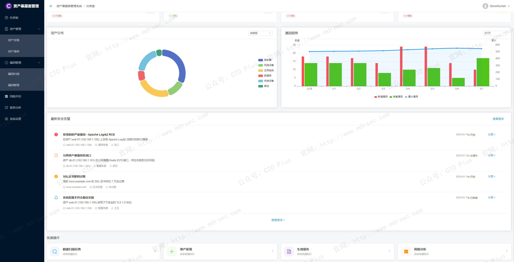
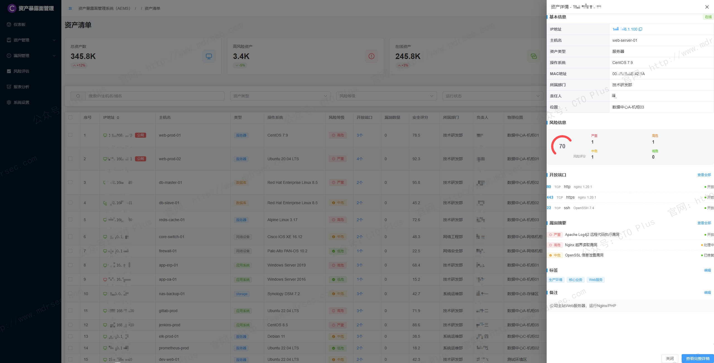
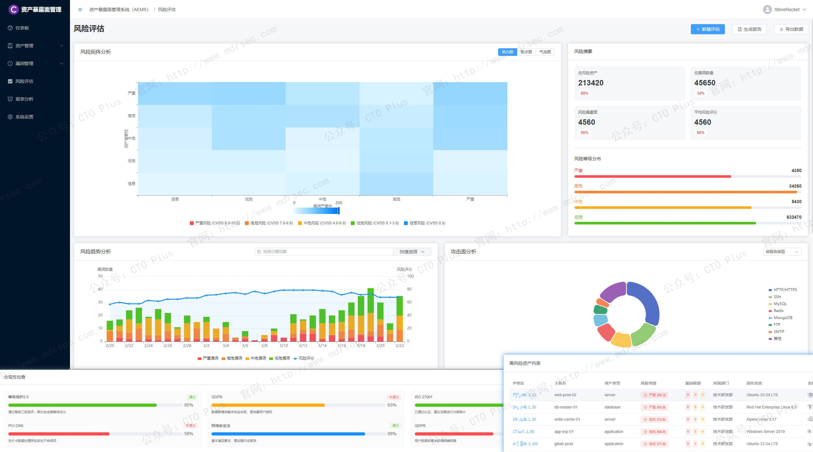

# 资产暴露面管理系统（AEMS）

- 官网地址：http://www.mdrsec.com
- 演示系统：http://www.play.mdrsec.com
- 产品文档：http://www.docs.mdrsec.com

## 关于我们

- 官网： http://www.mdrsec.com

我们的技术文章和产品概述欢迎浏览我们的门户。

- 公众号：CTO Plus

最新的动态欢迎关注我们官方唯一公众号。

- 作者QQ

更详细更具体的需求，或者项目合作，或者问题 欢迎联系我。

- QQ群

我们官方组建的QQ群，如果您有兴趣也可以加入我们。

- 请喝咖啡

如果感兴趣，也可以请我喝杯咖啡

## 产品核心功能模块

传统CMDB（配置管理数据库）、漏洞扫描器或外部攻击面管理（EASM）产品往往各自为政，无法统一、实时、精准地回答一个核心问题：**“攻击者视角下，我们企业所有可被触及的资产及其暴露面风险到底在哪里？”**

出于这一点，我们自研了资产暴露面管理系统（AEMS），它不是另一个资产清单工具，而是以**攻击者视角**为设计原点，以**资产全生命周期可见性**为基础，以**暴露面收敛与风险优先级**为核心输出的一体化安全运营平台。其本质是连接内外部资产数据、漏洞情报、业务上下文与修复动作的“暴露面中枢”。

接下来介绍下我们AEMS系统的功能模块和特点

---

## AEMS核心功能模块

### 1. 全域资产发现与统一资产库（“无一遗漏”）

功能详述：

- 主动探测：支持IPv4/IPv6空间、域名、证书、AS号等；可配置探测深度（端口/服务/协议/指纹），支持高隐蔽扫描模式。
- 被动监听：对接网络流量（NetFlow、VPC Flow Logs）、DNS日志、代理日志、云API调用记录，发现瞬时或临时资产。
- 云原生集成：原生连接AWS、Azure、GCP、阿里云、腾讯云等，通过API同步VPC、负载均衡、对象存储、Serverless函数、托管K8s等资产。
- 边缘与IoT：通过主动探测+协议指纹识别工业设备、摄像头、打印机、路由器等非传统IT资产。
- 去重与规范化：基于多源数据融合算法，将不同来源的资产（IP、域名、证书、代码仓库、API端点、SaaS实例）关联为统一资产对象，形成资产图谱。

产出：动态更新的统一资产清单，含唯一标识符、类型、归属、环境标签、业务重要性、首次发现时间、最后活跃时间等元数据。

### 2. 多维暴露面识别（“攻击者能看到什么”）

功能详述：

- 网络暴露：
    - 互联网可达端口/服务（包括非标准端口）
    - 云安全组/ACL/NACL过宽策略（0.0.0.0/0）
    - 未授权的公网IP及弹性IP
- 应用暴露：
    - Web应用的敏感路径（/admin、/api/v1/docs、/swagger）
    - 泄露的Git仓库、对象存储桶（公开读/写）
    - 第三方组件暴露（Shodan/Censys可识别的banner）
- 身份暴露：
    - 暴露的SSH密钥、云凭证、数据库连接串
    - 公开代码仓库中的硬编码凭证
    - 泄露的开发者Token、服务账号
- API暴露：
    - 未认证的API端点、GraphQL内省暴露
    - 云函数或API网关的匿名调用权限
- 供应链暴露：
    - 关联的第三方SaaS暴露（如Jira、Confluence公开实例）
    - 合作伙伴互联VPN/专线的暴露子网
    - 开源依赖中已被公开利用的暴露风险

特性：支持定时+实时触发，与威胁情报联动识别“高价值暴露面”（如已被C2服务器扫描过的端口）。

### 3. 暴露面风险评估与优先级计算（“先修什么”）

功能详述：
采用动态风险评分模型，融合以下因子：

- 资产重要性：基于业务标签、数据敏感度、合规等级（PCI-DSS、HIPAA等）
- 暴露面可利用率：是否存在已知CVE、是否存在公开POC/EXP、是否出现在野利用
- 暴露面可达性：是否需多跳攻击、是否需要绕过WAF/IDS
- 攻击者关注度：来自威胁情报的暗网讨论、漏洞利用框架集成情况、扫描器热度
- 暴露趋势：暴露时长、暴露范围变化（如从内网暴露到公网）

输出：

- 风险优先级队列：从Critical到Low四级，辅以预计修复时间（ETR）
- 攻击路径模拟：展示攻击者从公网逐步渗透至核心资产的关键暴露面节点
- 可操作建议：例如“关闭端口3389并限制RDP到堡垒机”“移除存储桶公开读权限”

### 4. 攻击者视角可视化（“如何被攻击”）

功能详述：

- 外部攻击面地图：类似攻击者使用的测绘平台界面，展示所有可被扫描到的资产入口点，按地理位置/云区域/ASN分组。
- 暴露面攻击链图：将资产、暴露面、漏洞、情报关联成有向图，高亮最容易进入的“边缘暴露面”。
- 时间轴回放：回溯某一时间段内暴露面的变化（例如：某端口在午夜临时开放了2小时），支持合规审查。
- 业务上下文叠加：在可视化中标记生产环境、核心数据库、支付系统等，便于管理层理解风险。

### 5. 暴露面生命周期管理（“闭环收敛”）

功能详述：

- 暴露面创建：新资产/暴露面首次出现时触发告警（如新开公网端口、新增未认证API）。
- 暴露面验证：自动重扫确认暴露状态是否存在误报（例如端口实际被入口ACL屏蔽）。
- 修复任务工单：集成Jira、ServiceNow、飞书、钉钉，自动指派给资产负责人，附修复指引。
- 修复验证：系统自动重测暴露面是否已收敛（如端口关闭、存储桶私有化）。
- 异常重开：若暴露面在修复后再次出现，触发升级告警并记录责任人。
- 暴露面老化策略：超过N天未活跃的暴露面自动标记为“待废弃”，建议清理。

### 6. 变更驱动的实时暴露感知（“动静结合”）

功能详述：

- 云配置变更流：实时订阅CloudTrail、EventBridge等，当安全组规则、路由表、负载均衡监听器发生变更时，立即评估新暴露面。
- CI/CD集成：在IaC（Terraform、CloudFormation）部署阶段预检查是否会引入公网暴露风险，阻断高风险变更。
- 容器与编排：监控K8s Service Type=LoadBalancer、Ingress新规则、NodePort暴露，自动关联至工作负载。
- 代码仓库监控：检测.git泄露、配置文件变更引入新凭证暴露。

### 7. 暴露面情报与威胁狩猎（“先知风险”）

功能详述：

- 攻击者基础设施关联：将企业暴露面与已知C2服务器、扫描器IP、Tor出口节点、恶意ASN进行碰撞。
- 数据泄露监控：监测暗网、Telegram、Pastebin中是否出现企业域名/公网IP/凭证片段。
- 漏洞预警联动：当新漏洞爆发（如Log4j、Spring4Shell），AEMS立即扫描历史暴露面中是否存在受影响服务/版本，并标记为“应急暴露”。
- 暴露面评分动态调整：某暴露面原为Low风险，但因出现针对该服务的在野利用框架，分数自动提升至High。

### 8. 合规与报告（“可举证”）

功能详述：

- 内置合规包：等保2.0、GDPR、ISO 27001、NIST CSF、CIS Controls针对暴露面管理的要求映射。
- 定期报告：自动生成面向CISO的“暴露面趋势报告”（收敛率、新增暴露数、MTTR），面向运维的“高频暴露资产排行”，面向审计的“暴露面变更审计日志”。
- 证据保留：每次暴露面发现与修复的完整时间戳、扫描结果、修复前后对比截图。

### 9. 功能模块清单

1. 资产自动发现
- 支持IP段扫描
- 端口和服务识别
- 操作系统指纹识别
- 资产关系图谱

2. 漏洞管理
- CVE漏洞库集成
- 自动漏洞扫描
- 风险评级和评分
- 修复建议和工作流

3. 风险评估
- 风险矩阵分析
- 攻击面评估
- 威胁建模
- 风险量化评分

4. 监控告警
- 实时资产监控
- 安全事件告警
- 风险阈值告警
- 通知中心集成

5. 报表系统
- 自定义报表模板
- 数据可视化
- 趋势分析
- 合规性报告

---

## AEMS关键特性

我们的AEMS系统具备差异化竞争优势

- 特性1：攻击者视角而非资产视角 - 传统工具以“我们有什么资产”为起点，AEMS以“攻击者能发现什么”为起点，因此会发现影子IT、废弃但仍可访问的资产、云上无标签资源等。
- 特性2：实时且持续，而非周期性扫描 - 依赖变更事件流（云API、CI/CD、网络Flow），暴露面识别延迟达到分钟级，远低于传统扫描器的天级别。
- 特性3：暴露面与业务上下文的深度融合 - 不是孤立的技术端口列表，而是能回答“暴露的Redis实例是否承载生产支付缓存”，因此优先级更准。
- 特性4：无代理、无侵扰 - 对现有资产无需安装Agent，通过旁路流量、API、主动探测组合实现，适用于容器、无服务器、第三方托管环境。
- 特性5：闭环可度量 - 从发现→评估→响应→验证→收敛，每个环节有KPI（暴露面平均修复时间MTTR、暴露面反弹率），帮助安全团队证明价值。
- 特性6：开放集成架构 - 向北提供风险事件给SIEM/SOAR；向南调用漏洞扫描器、WAF、防火墙、云策略引擎进行自动阻断；横向同步资产到CMDB。
- 特性7：供应链暴露延伸 - 不仅管理企业自有资产，还能扫描合作伙伴分配的互联子网、共享SaaS实例、开源依赖的暴露风险。

---

## 四、部署模式与扩展能力

### 部署模式

1. **纯SaaS模式**：企业授权域名/公网IP范围，SaaS引擎从云端测绘，适用于外部攻击面管理。
2. **混合模式**：SaaS负责外部发现，企业内部部署轻量探测器（主动扫描+流量监听）识别内网/云VPC暴露面。
3. **私有化全栈**：大型客户全量部署在自有数据中心，支持离线威胁情报更新。

### 扩展能力

- **与NDR/EDR联动**：当暴露面被实际利用时，触发流量或端点告警。
- **与ASM（攻击面管理）融合**：AEMS聚焦暴露面，ASM涵盖漏洞、错误配置、泄露凭证等，两者可形成完整攻击面管理平台。
- **自动修复playbook**：对于典型暴露（如安全组过宽），可调用云API自动收紧策略，但需业务授权。

---

## 五、AEMS给企业带来的价值

| 价值维度            | 具体表现                             |
|-----------------|----------------------------------|
| **风险降低**        | 主动发现并收敛90%以上的非必要暴露面，显著减少攻击入口     |
| **效率提升**        | 将暴露面修复优先级准确率提升80%，避免安全团队淹没在海量漏洞中 |
| **合规满足**        | 提供等保、NIST等要求的“最小暴露面原则”自动化证据      |
| **DevSecOps落地** | 在IaC和CI/CD阶段阻断暴露面引入，左移安全         |
| **云支出优化**       | 发现未使用的公网IP、闲置负载均衡器，协助FinOps回收资源  |
| **MSS/MDR赋能**   | 为托管安全服务商提供标准化的暴露面数据，提升远程监测能力     |

---

## 最后

在攻击者利用全网扫描、自动化利用工具、零日漏洞的速度远超企业响应能力的今天，**不知道自己的暴露面，就等于主动邀请攻击者**。资产暴露面管理系统（AEMS）通过持续、实时、攻击者视角的方法论，帮助企业从“被动响应”转向“主动暴露面治理”，将安全运营的起点前移到攻击发生之前。

我们自研的AEMS具备：**完整的资产发现能力** + **精准的暴露面识别** + **动态风险优先级** + **闭环修复验证** + **与IT流程的深度集成**。它不仅仅是安全团队的工具，更是CTO/CIO/CISO用来管理数字业务风险的战略仪表盘。

随着AI辅助攻击路径预测、图数据库实时暴露面关联、以及暴露面保险（Exposure Insurance）等新模式的兴起，AEMS将成为企业网络安全架构中与防火墙、EDR同等重要的基础组件。

---

这块类似的国外安全厂商还有：Randori、CyCognito、Azure External Attack Surface Management

## 产品清单

### 企业网络安全运营中心产品

- 资产安全配置管理系统（SCMDB）
- 终端侦测与响应系统（EDR）
- 网络侦测与响应系统（NDR）
- 企业网络资产攻击面管理系统（CAASM）
- 资产暴露面管理系统（AEMS）
- 网络安全蜜罐管理系统（HoneyPot）
- 安全事件收集与告警管理系统（SIEM）
- 扩展侦测与响应系统（XDR）
- 多引擎脆弱性扫描系统（VAS）
- 多源日志审计监测系统（LAS）
- 网络安全威胁情报中心（TIS）
- 网络安全漏洞库管理系统（VDBS）
- 网络安全编排与自动化响应（SOAR）
- 威胁狩猎系统（THS）
- 数据库安全审计系统（DSAS）
- AI智能体安全态势管理系统（AISPM）
- Web防火墙（WAF）
- 网站安全监测平台（WSM）
- 网络安全态势感知平台（SSAP）
- 网络安全自动化应急响应工具系统（NSRT）
- 企业网络安全运维工具系统（SecTools）
- 网络安全自动化等保测评系统（ASES）
- 浏览器安全监测防护系统（BSMPS）
- 网络安全用户实体行为分析系统（UEBA）
- 互联网电信诈骗预警防护系统（TPFWS）
- 云原生安全管理平台（CNAPP）
- 自动化渗透测试系统（PTS）
- 工业企业信息安全监测中心（IoT SOC）
- 企业智能安全运营中心（AISOC）

### 企业自动化运维产品

- 运维智能监控告警管理平台（AIMAMS）
- 企业网络工具系统（NTools）
- 自动化测试系统（AutoTest）
- 自动化运维系统（AutoOps）
- 企业运维工具系统（OpsTools）
- 物联网管理系统（IoTS）
- 软件开发生命周期管理系统（SDLC）
- IT流程管理系统（ITSM）

### 企业数字化运营资源管理系统产品

- 企业制造执行管理系统（MES）
- 制造执行管理系统（MES）汽车/零部件行业
- 制造执行管理系统（MES）电子/半导体行业
- 企业运输管理系统（TMS）
- 跨境电商企业资源管理系统（ERP）
- 企业客户关系管理系统（CRM）
- 跨境电商仓库管理系统（WMS）
- 企业财务管理系统（FMS）
- 企业质量管理系统（QMS）
- 精准营销管理系统（PMS）
- 智能生产管理系统（SPMS）
- 企业工单（HR·OA）系统
- 产品生命周期管理系统（PLM）
- 供应链管理系统（SCM）
- 供应商关系管理（SRM）
- 订单管理系统（OMS）
- 电商BI系统（BI）
- 智能互联网分布式爬虫系统（AISpider）

## ABOUT

**【关于我们】**

* [主页：http://116.205.137.183/index_pro.html](http://116.205.137.183/index_pro.html)
* [Articulate v1.0](https://mp.weixin.qq.com/s/0yqGBPbOI6QxHqK17WxU8Q)
* [Articulate v2.0](https://mp.weixin.qq.com/s/V5Axn-ZWi22ubh5Jiocb9g)

 🥰

## Contact

  
**< 微信公众号 >**

  
**< QQ技术交流群 >**

**< 联系作者 >**

## **【代码工程系列】**

* [Python和Go的设计模式](https://github.com/zrf-rocket/DesignPattern)
    * GitHub：https://github.com/zrf-rocket/DesignPattern
    * Gitee：https://gitee.com/SteveRocket/design_pattern

* [Python、Go的编码技巧cookbook](https://github.com/zrf-rocket/CookBook)
    * GitHub：https://github.com/zrf-rocket/CookBook
    * Gitee：https://gitee.com/SteveRocket/cook-book

* [Go代码示例](https://github.com/zrf-rocket/PracticeGo)
    * GitHub：https://github.com/zrf-rocket/PracticeGo
    * Gitee：https://gitee.com/SteveRocket/practice_go

* [Python代码示例](https://github.com/zrf-rocket/PracticePython)
    * GitHub：https://github.com/zrf-rocket/PracticePython
    * Gitee：https://gitee.com/SteveRocket/practice_python

* [Python Web框架的示例代码](https://github.com/zrf-rocket/PythonFramework)
    * GitHub：https://github.com/zrf-rocket/PythonFramework
    * Gitee：https://gitee.com/SteveRocket/python_framework
    * Django：https://github.com/zrf-rocket/PythonFramework/tree/master/django_framework
    * Flask：https://github.com/zrf-rocket/PythonFramework/tree/master/flask_framework

* [Python 爬虫框架和技术](https://github.com/zrf-rocket/PracticeSpider)
    * GitHub：https://github.com/zrf-rocket/PracticeSpider
    * Gitee：https://gitee.com/SteveRocket/practice_spider

* [Rust代码示例](https://github.com/zrf-rocket/PracticeRust)
    * GitHub：https://github.com/zrf-rocket/PracticeRust
    * Gitee：https://gitee.com/SteveRocket/practice_rust

* [Vue代码示例](https://github.com/zrf-rocket/PracticeVue)
    * GitHub：https://github.com/zrf-rocket/PracticeVue
    * Gitee：https://gitee.com/SteveRocket/practice_vue

* [前端代码示例](https://github.com/zrf-rocket/PracticeFronted)
    * GitHub：https://github.com/zrf-rocket/PracticeFronted
    * Gitee：https://gitee.com/SteveRocket/practice_fronted

* [Python自动化测试框架](https://github.com/zrf-rocket/PythonTestAutomationFramework)
    * GitHub：https://github.com/zrf-rocket/PythonTestAutomationFramework
    * Gitee：https://gitee.com/SteveRocket/python_test_automation_framework

* [Python和Go的算法代码示例](https://github.com/zrf-rocket/Algorithms)
    * GitHub：https://github.com/zrf-rocket/Algorithms
    * Gitee：https://gitee.com/SteveRocket/Algorithms

* [Python和Go的数据结构代码示例](https://github.com/zrf-rocket/DataStructure)
    * GitHub：https://github.com/zrf-rocket/DataStructure
    * Gitee：https://gitee.com/SteveRocket/data_structure

* [编码规范](https://github.com/zrf-rocket/DevGuide)
    * GitHub：https://github.com/zrf-rocket/DevGuide
    * Gitee：https://gitee.com/SteveRocket/develop_guide

* [编码安全规范](https://github.com/zrf-rocket/SecGuide)
    * GitHub：https://github.com/zrf-rocket/SecGuide
    * Gitee：https://gitee.com/SteveRocket/security_guide

## **【产品系列】**

* [安全运营中心（SOC）-威胁情报与漏洞库管理系统](https://github.com/zrf-rocket/tip_platform)
    * GitHub：https://github.com/zrf-rocket/tip_platform
    * Gitee：https://gitee.com/SteveRocket/tip_platform

* [主机监控系统-日志收集与报警管理系统（SIEM）](https://github.com/zrf-rocket/SIEM)
    * GitHub：https://github.com/zrf-rocket/SIEM
    * Gitee：https://gitee.com/SteveRocket/siem

* [安全运营中心（SOC）-终端侦测与响应系统（EDR）](https://github.com/zrf-rocket/EDR_SOC)
    * GitHub：https://github.com/zrf-rocket/EDR_SOC
    * Gitee：https://gitee.com/SteveRocket/edr_soc

* [安全运营中心（SOC）-网络资产攻击面管理（Cyber asset attack surface management）系统](https://github.com/zrf-rocket/CAASM)
    * GitHub：https://github.com/zrf-rocket/CAASM
    * Gitee：https://gitee.com/SteveRocket/caasm

* [安全运营中心（SOC）-信息资产采集与安全评估系统（ICSA）](https://github.com/zrf-rocket/SOC_ICSA)
    * GitHub：https://github.com/zrf-rocket/SOC_ICSA
    * Gitee：https://gitee.com/SteveRocket/SOC_ICSA

* [安全运营中心（SOC）-安全编排与自动化响应（SOAR）](https://github.com/zrf-rocket/soar_platform)
    * GitHub：https://github.com/zrf-rocket/soar_platform
    * Gitee：https://gitee.com/SteveRocket/soar_platform

* [研发测试安全运维一体化平台（DevTestSecOps）](https://github.com/zrf-rocket/DevSecOps-SDLC)
    * GitHub：https://github.com/zrf-rocket/DevSecOps-SDLC
    * Gitee：https://gitee.com/SteveRocket/devsectestops-sdlc

* [安全运营中心（SOC）-Penetration Test-自动化渗透测试平台（PT-PenTest）](https://github.com/zrf-rocket/PenetrationTest)
    * GitHub：https://github.com/zrf-rocket/PenetrationTest
    * Gitee：https://gitee.com/SteveRocket/penetration_test

* [cicd-持续集成持续部署系统（CI/CD）](https://github.com/zrf-rocket/CICD)
    * GitHub：https://github.com/zrf-rocket/CICD
    * Gitee：https://gitee.com/SteveRocket/cicd

* [DevSecTestOps-SDLC-自动化研发安全测试运维一体化平台（DevSecTestOps）](https://github.com/zrf-rocket/DevSecOps-SDLC)
    * 代码自动构建、代码安全审计、自动测试、自动部署、自动接口测试
    * GitHub：https://github.com/zrf-rocket/DevSecOps-SDLC
    * Gitee：https://gitee.com/SteveRocket/dev-sec-ops-sdlc

* [AI图像识别-智能缺陷检测系统]()
    * [基于AI图像识别的工业缺陷检测应用系统（GPU&FPGA）](https://mp.weixin.qq.com/s/04qefQFg-Pg1Gcqq1vBLQQ)
    * [基于AI图像识别的智能缺陷检测系统，在钢铁行业的应用-技术方案](https://mp.weixin.qq.com/s/dSHbnuOwQZzE4CvPr1JYjg)

# CAASM 网络资产攻击面管理（Cyber asset attack surface management）和 EASM 外部攻击面管理（External attack surface management）系统

## 功能特性

## 架构图

